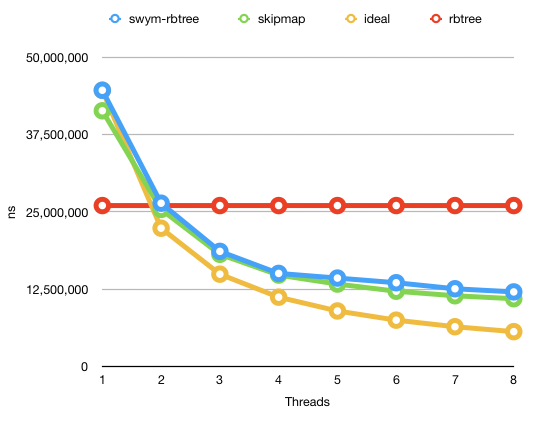
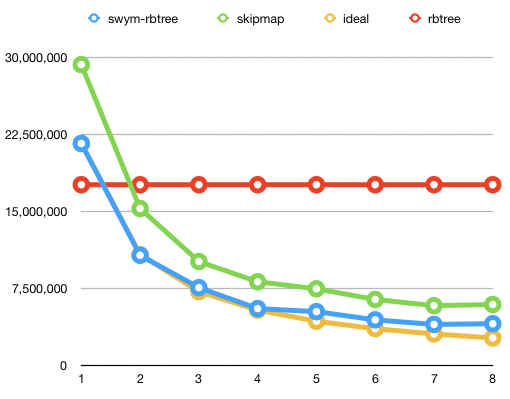

# Benchmarks

Benchmarks run using jemallocator on macos sierra and `-Ctarget-cpu=native`. Benchmarks recorded on Feb 24, 2019.

```
  Processor Name:	Intel Core i7
  Processor Speed:	2.9 GHz
  Number of Processors:	1
  Total Number of Cores:	4
  L2 Cache (per Core):	256 KB
  L3 Cache:	8 MB
```

These benchmarks compare
 - the transactional `swym-rbtree`
 - the lock-free crossbeam skipmap
 - the single threaded `rbtree`
 - single threaded `BTreeMap`
 - Mutex/RwLock wrapped `BTreeMap`

Skipmaps and rbtrees are fundamentally different data structures with different tradeoffs, but there's not many options for concurrent sorted containers in rust for comparison.

"Ideal" is calculated based on `swym-rbtree`'s single threaded ops/sec, then multiplying by the number of threads.

### Insert 100,000 Random Values

Numbers 0..100_000 are put into a vec, and then shuffled before the benchmark is run. The benchmark consists of inserting the elements from the vec into the tree in the shuffled order.

Every iteration of the benchmark calls `std::mem::forget(tree)` at the end to exclude the destructor - though this may cause some noise due to increased memory consumption.



### Lookup 100,000 Random Values

Numbers 0..100_000 are put into a vec, shuffled, then put into the tree before the benchmark is run. The benchmark consists of looking up the elements from the vec in the tree in the shuffled order.



### Removal

TODO: swym-rbtree has not had the removal algorithm tuned for performance yet, so benchmarks would not be particularly useful.